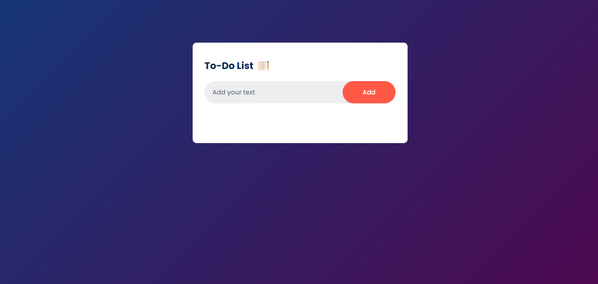
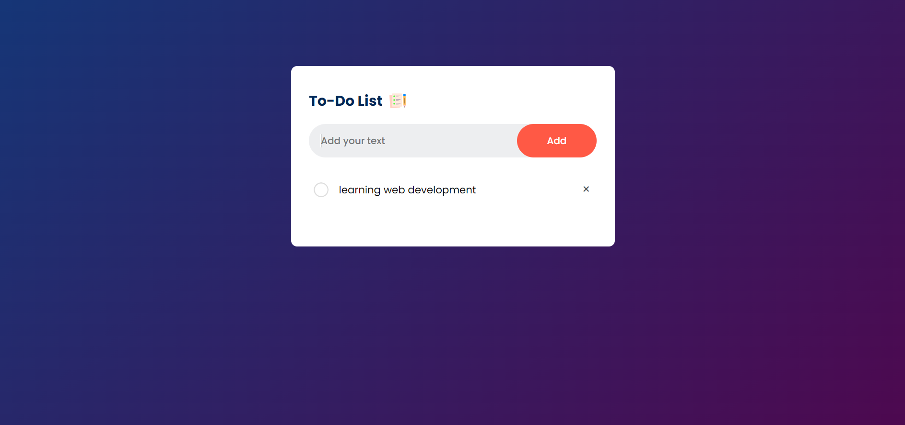
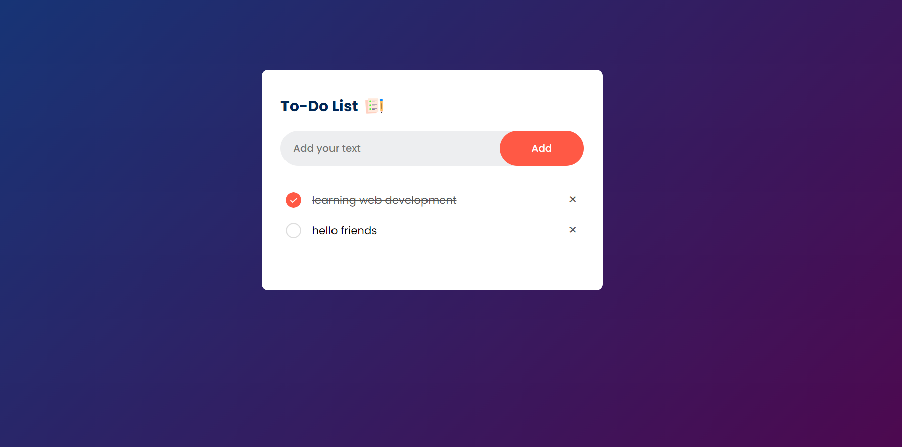

# To-Do App

A simple and interactive To-Do List application built with HTML, CSS, and JavaScript. This app allows users to add tasks, delete tasks, and mark tasks as done. Local storage is used to store the tasks.

# Visit the Website

https://maheshhattimare.github.io/todo-app/

## Features

- User-friendly interface
- Add, delete, and mark tasks as done
- Responsive design

## Technologies Used

- HTML
- CSS
- JavaScript
- Local Storage

## Screenshots

### Interface


### Add Note


### Mark as Done


## Installation

1. Clone the repository:
    ```bash
    git clone https://github.com/maheshhattimare/todo-app.git
    ```
2. Navigate to the project directory:
    ```bash
    cd todo-app
    ```
3. Open `index.html` in your web browser to start the application.

## Usage

1. Open the `index.html` file in your preferred web browser.
2. Add tasks using the input field and "Add" button.
3. Mark tasks as done by clicking the checkbox next to each task.
4. Delete tasks by clicking the delete button next to each task.


